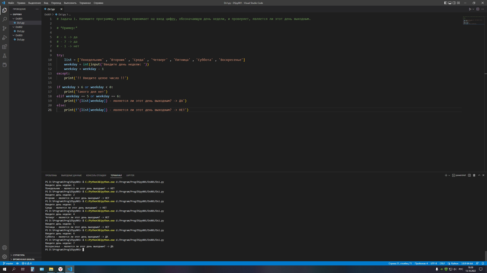

### Задача 1. Напишите программу, которая принимает на вход цифру, обозначающую день недели, и проверяет, является ли этот день выходным.

### *Пример:*

### - 6 -> да
### - 7 -> да
### - 1 -> нет

