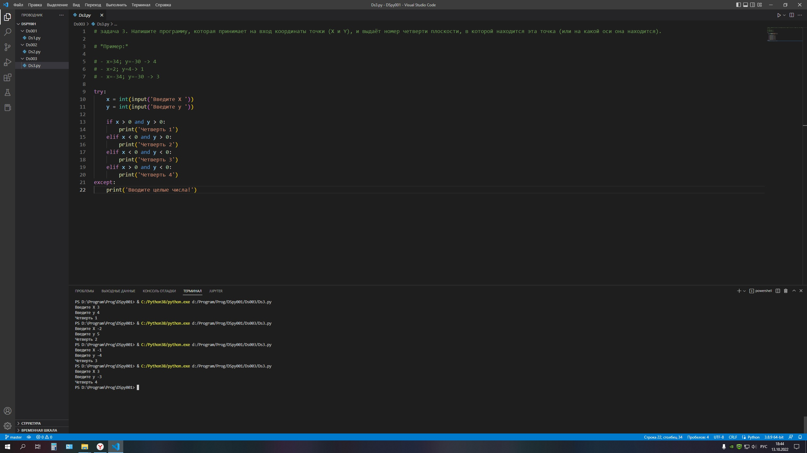

### Задача 3. Напишите программу, которая принимает на вход координаты точки (X и Y), и выдаёт номер четверти плоскости, в которой находится эта точка (или на какой оси она находится).

### *Пример:*

### - x=34; y=-30 -> 4
### - x=2; y=4-> 1
### - x=-34; y=-30 -> 3

